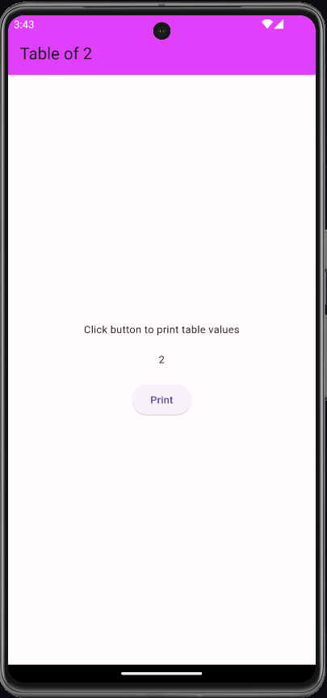
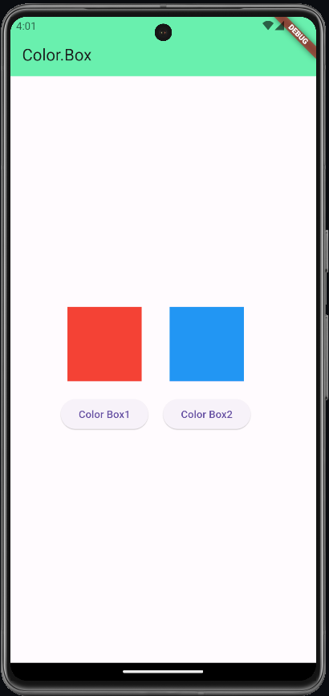
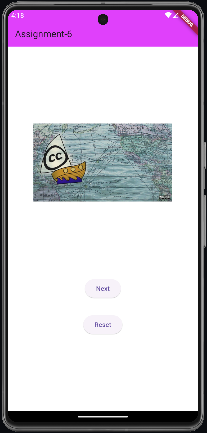

# Assignment 4

### Explore the beauty of Flutter with this project that effortlessly prints the multiplication table of 2. A sleek interface and dynamic functionality make learning and understanding multiples a breeze. Perfect for Flutter enthusiasts and beginners alike.

## Preview

# Assignment 5

### This Flutter project featuring two containers and buttons. Click buttons to dynamically change container colors, adding a touch of visual delight to your app.

## Preview

# Assignment 6

### Engage with a captivating image carousel in Flutter. Navigate through images with the 'Next' button, and reset to the beginning with 'Reset' for a seamless and delightful user experience.

## Preview

