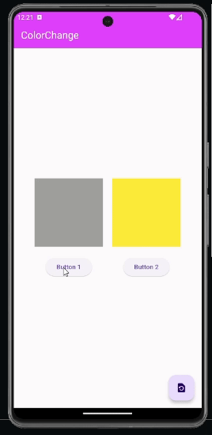

# FlutterColorSwitcher

### Explore "FlutterColorSwitcher," a Flutter project featuring two containers with corresponding elevated buttons. Effortlessly change container colors to red, green, and blue using dedicated buttons and keep track of counters. The floating action button ensures a swift reset to the initial phase, where both containers start with a stylish grey and yellow hue.

## Preview

## Explanation

### In the "FlutterColorSwitcher" project, I implemented two methods to handle color changes for the two containers. The methods incrementBox1 and incrementBox2 are responsible for incrementing counters associated with each container. Additionally, I created methods setBox1Color and setBox2Color to dynamically determine the color of each container based on the counter values. The color choices include red, green, and blue, with an initial phase where containers are colored grey and yellow respectively.
